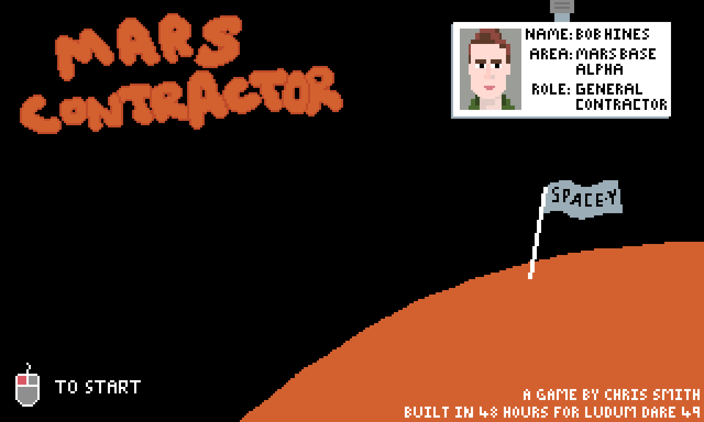

# Mars contractor

An entry for [Ludum Dare 49](https://ldjam.com/events/ludum-dare/49), the theme of which was
"Unstable".

In Mars Contractor, you take on the glamorous role of a general contractor on SpaceY’s Mars Base Alpha.
Your first task is to fix the unstable reactor, but is that the only thing that’s unstable?……

Tools:

* [Ebiten 2D game library](https://ebiten.org/)
* [Aseprite](https://www.aseprite.org/) for art
* [LMMS](https://lmms.io/) for sound

Play online at: https://csmith.github.io/ld49-mars-contractor/ (see the `docs` directory for source)
